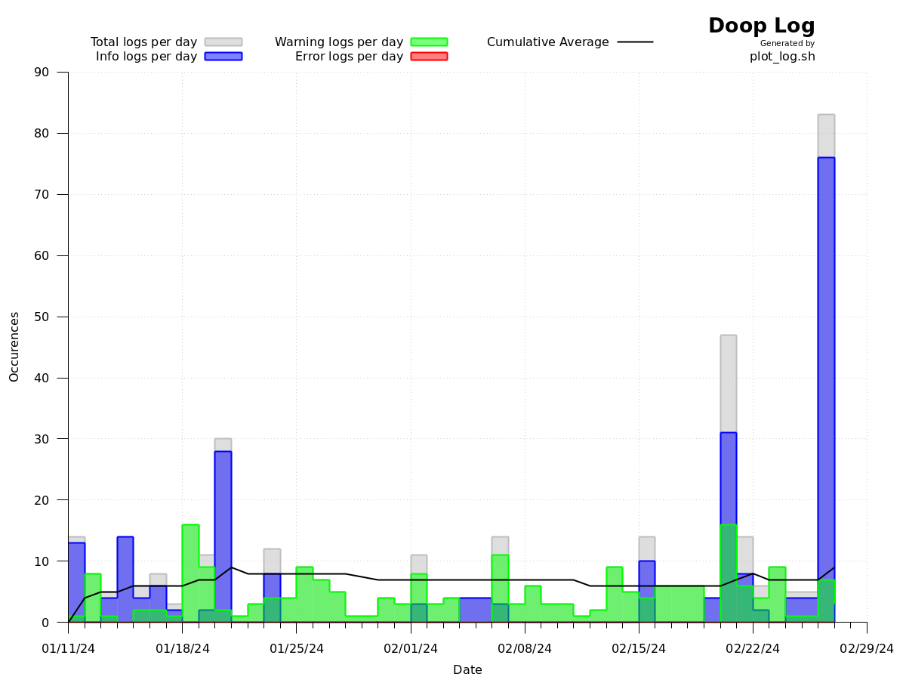

# doop_plot
Graphs frequency of log outputs from [Jaxydog/doop](https://github.com/Jaxydog/doop).

Developed alongside [Jaxydog](https://github.com/Jaxydog).

## Requirements

Last tested from Jaxydog/doop commit [`cabad396`](https://github.com/Jaxydog/doop/tree/cbad3961bd3f41a77d3de74e6fb0349f5ef72d47).

Build and tested exclusively for:
* Gnuplot 5.2 patchlevel 8 on Ubuntu 20.04
* Gnuplot 5.4 patchlevel 2 on Ubuntu 22.04

It may work on other versions, but this is entirely untested.

## Usage
```
$ ./csv.sh
$ gnuplot -p ./plot.gp
```
Expected output (as of [`a2f9b15`](https://github.com/RemasteredArch/doop_plot/tree/a2f9b152716c1020dd9c9e11326a4b136debab3c)):


## Disclaimer
doop_plot is work in progress software! **Use at your own risk!**
