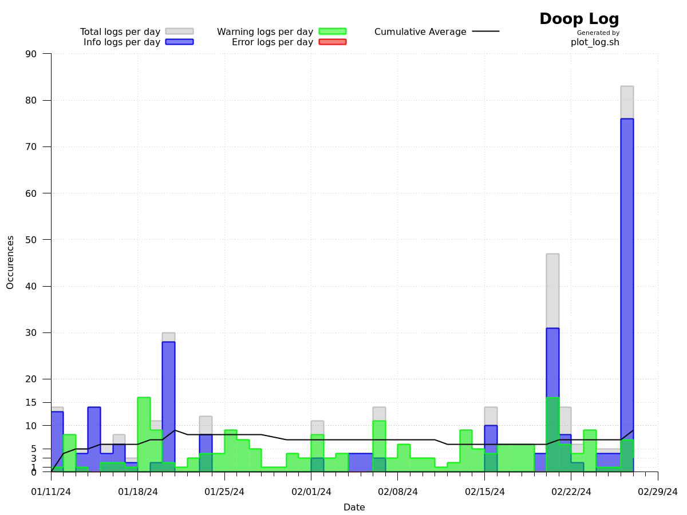

# doop_plot
Graphs frequency of log outputs from [Jaxydog/doop](https://github.com/Jaxydog/doop). Last tested from commit [`cabad396`](https://github.com/Jaxydog/doop/tree/cbad3961bd3f41a77d3de74e6fb0349f5ef72d47).

Developed alongside [Jaxydog](https://github.com/Jaxydog).

## Usage
```
$ ./csv.sh
$ gnuplot -p ./plot.gp
```
Expected output (as of [`1209099`](https://github.com/RemasteredArch/doop_plot/tree/12090998dcdd49234589bc546055cf3bbdee733b)):


## Disclaimer
doop_plot is work in progress software! **Use at your own risk!**
